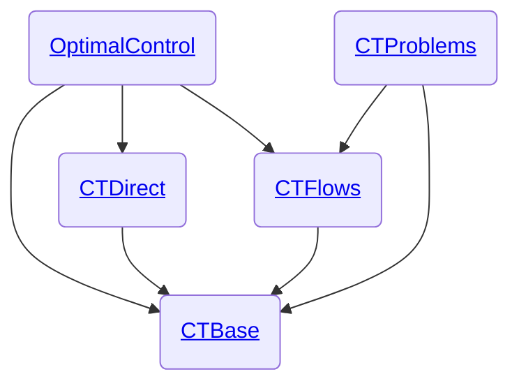

# Welcome to control-toolbox!

The control-toolbox ecosystem gathers `Julia` packages for mathematical control and applications. 

The root package is [`OptimalControl.jl`](https://github.com/control-toolbox/OptimalControl.jl) which aims to provide tools to modelise and solve optimal control problems by direct and indirect methods.

From the [documentation](http://control-toolbox.org/OptimalControl.jl), you can find tutorials to define and solve optimal control problems with the `OptimalControl.jl` package. 

See also some applications of the `OptimalControl.jl` package:

- [Optimal control in Medical Resonance Imaging](https://control-toolbox.org/mri)
- [Orbit transfer from space mechanics](https://control-toolbox.org/kepler)

## Documentation

Please visit our [webpage](http://control-toolbox.org) or go directly to the documentation: 

[](http://control-toolbox.org/OptimalControl.jl)

## Installation

To install a package from the control-toolbox ecosystem, you must add the `ct-registry` into your `Julia` configuration, and then you can install any package as usual.

```shell
julia> ]
pkg> registry add https://github.com/control-toolbox/ct-registry.git
pkg> add OptimalControl
```

Note: sometimes the above command can fail due to the default Julia registry ('General') not being installed for some reason.
You can check that both registries are installed with

```shell
pkg> registry st
Registry Status 
 [cbe350a3] ct-registry (https://github.com/control-toolbox/ct-registry)
 [23338594] General (https://github.com/JuliaRegistries/General.git)
```

If the General registry is missing, simply add it

```shell
pkg> registry add General
```
then retry the add command for the OptimalControl package.

## Main repositories

The [main repositories](https://github.com/orgs/control-toolbox/repositories?type=all) of the control-toolbox ecosystem are:

* [`ct-registry`](https://github.com/control-toolbox/ct-registry): the control-toolbox registry since the packages are not yet available in the [official registry](https://github.com/JuliaRegistries/General)
* [`CTBase.jl`](https://github.com/control-toolbox/CTBase.jl): fundamentals of the control-toolbox ecosystem
* [`CTDirect.jl`](https://github.com/control-toolbox/CTDirect.jl): direct transcription of an optimal control problem and resolution
* [`CTFlows.jl`](https://github.com/control-toolbox/CTFlows.jl): classical flow, Hamiltonian flow, flow from optimal control problem
* [`CTProblems.jl`](https://github.com/control-toolbox/CTProblems.jl): library of optimal control problems
* [`OptimalControl.jl`](https://github.com/control-toolbox/OptimalControl.jl): main package



## Extras

* [`bocop`](https://github.com/control-toolbox/bocop): Bocop3, a direct solver for optimal control problem developed in `C++`.
* [Control loss examples](https://github.com/control-toolbox/control-loss): examples of optimal control problems with permanent and regional controls.
* [3D visualisation - averaged Kepler](https://github.com/control-toolbox/averaged_kepler): 3D visualisation of an optimal synthesis from the averaged Kepler problem.
* [Medical Resonance Imaging](https://github.com/control-toolbox/spin): simulations of the bi-saturation problem in MRI.
* [Zermelo navigation problems](https://github.com/control-toolbox/Zermelo): Kepler, Landau and Lindblad Zermelo problems.

## Discussions

We discuss about the control-toolbox ecosystem here:

* [](https://github.com/issues?q=is%3Aopen+is%3Aissue+user%3Acontrol-toolbox+archived%3Afalse+)
* [](https://github.com/orgs/control-toolbox/discussions)
* [](https://github.com/control-toolbox/control-toolbox.github.io/wiki)

## Misc
 calligraphy by [Alain Hurtig](https://www.alain.les-hurtig.org)
