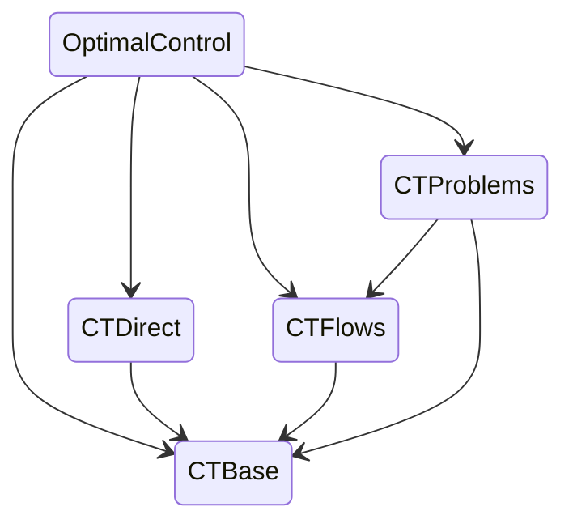

# Welcome to control-toolbox!

The control-toolbox ecosystem gathers `Julia` packages for mathematical control and applications. The root package is [`OptimalControl.jl`](https://github.com/control-toolbox/OptimalControl.jl) which aims to provide tools to solve optimal control problems by direct and indirect methods.

[](http://control-toolbox.org/docs/optimalcontrol)

## Installation

To install a package from the control-toolbox ecosystem, you must add the `ct-registry` into your `Julia` configuration, and then you can install any package as usual.

```shell
pkg> registry add https://github.com/control-toolbox/ct-registry.git
pkg> add OptimalControl
```

## Main repositories

The [main repositories](https://github.com/orgs/control-toolbox/repositories?type=all) of the control-toolbox ecosystem are:

* [`ct-registry`](https://github.com/control-toolbox/ct-registry): the control-toolbox registry since the packages are not yet available in the [official registry](https://github.com/JuliaRegistries/General)
* [`CTBase.jl`](https://github.com/control-toolbox/CTBase.jl): fundamentals of the control-toolbox ecosystem
* [`CTDirect.jl`](https://github.com/control-toolbox/CTDirect.jl): direct transcription of an optimal control problem and resolution
* [`CTFlows.jl`](https://github.com/control-toolbox/CTFlows.jl): classical flow, Hamiltonian flow, flow from optimal control problem
* [`CTProblems.jl`](https://github.com/control-toolbox/CTProblems.jl): library of optimal control problems
* [`OptimalControl.jl`](https://github.com/control-toolbox/OptimalControl.jl): main package



## Extras and applications

* [`bocop`](https://github.com/control-toolbox/bocop): Bocop3, a direct solver for optimal control problem developed in `C++`
* [Control loss examples](https://github.com/control-toolbox/control-loss)

## Discussions

We discuss about the control-toolbox ecosystem here:

* [](https://github.com/issues?q=is%3Aopen+is%3Aissue+user%3Acontrol-toolbox+archived%3Afalse+)
* [](https://github.com/orgs/control-toolbox/discussions)
* [](https://github.com/control-toolbox/control-toolbox.github.io/wiki)

## Misc
 calligraphy by [Alain Hurtig](https://www.alain.les-hurtig.org)
