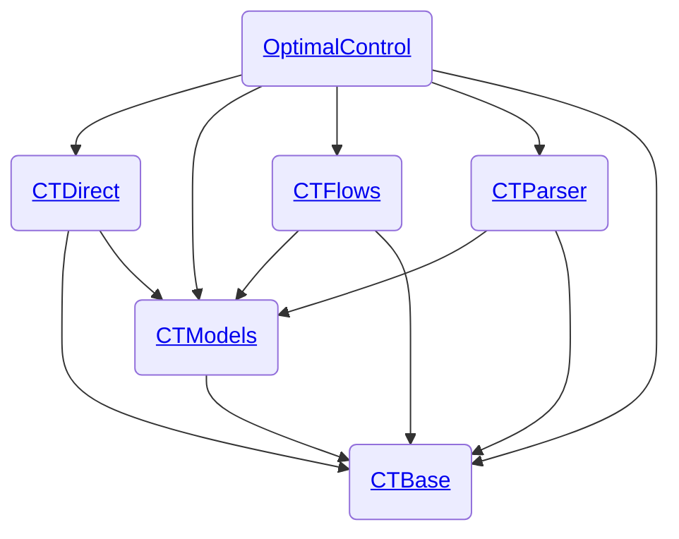

# Welcome to control-toolbox!

The **control-toolbox** ecosystem brings together <a href="https://julialang.org" style="display:inline-flex; align-items:center;">
  
  Julia
</a> packages for mathematical control and its applications.  

The core package, [OptimalControl.jl](https://github.com/control-toolbox/OptimalControl.jl), provides tools to model and solve optimal control problems defined by ordinary differential equations. It supports both direct and indirect methods, and can run on CPU or GPU.  

Complementing it, [OptimalControlProblems.jl](https://github.com/control-toolbox/OptimalControlProblems.jl) offers a curated collection of benchmark optimal control problems formulated with ordinary differential equations in Julia. Each problem is available both in the **OptimalControl** DSL and in **JuMP**, with discretised versions ready to be solved using the solver of your choice. This makes the package particularly useful for benchmarking and comparing different solution strategies.  

## Documentation

To learn how to define and solve optimal control problems in Julia, please refer to the documentation of **OptimalControl.jl**:

<p align="center">
  <a href="http://control-toolbox.org/OptimalControl.jl">
    
  </a>
</p>

The documentation includes:

- step-by-step examples of optimal control problems;  
- guides on problem definition, solver initialisation, solution plotting, and Hamiltonian flow;  
- tutorials on combining direct and indirect methods, and on working with discretised problems;  
- applications in the calculus of variations, MRI, space mechanics, and more.  

For a collection of benchmark problems that you can discretise and solve with the solver of your choice, see the documentation of **OptimalControlProblems.jl**:

<p align="center">
  <a href="http://control-toolbox.org/OptimalControlProblems.jl">
    
  </a>
</p>

## Installation [©](https://github.com/JuliaSmoothOptimizers/ADNLPModels.jl?tab=readme-ov-file#installation)

To install **OptimalControl.jl** please <a href="https://docs.julialang.org/en/v1/manual/getting-started/">open
Julia's interactive session (known as REPL)</a> and press <kbd>]</kbd> key in the REPL to use the package mode, then add the package:

```julia
julia> ]
pkg> add OptimalControl
```

> [!TIP]
> If you are new to Julia, please follow this [guidelines](https://github.com/orgs/control-toolbox/discussions/64).

> [!NOTE]
> Sometimes the above command can fail due to the default Julia registry ('General') not being installed for some reason.
> You can check that the registry is installed with
> 
> ```shell
> pkg> registry st
> Registry Status 
> [23338594] General (https://github.com/JuliaRegistries/General.git)
> ```
> 
> If the General registry is missing, simply add it
> 
> ```shell
> pkg> registry add General
> ```
> 
> then retry the `add` command.

## Main repositories

The control-toolbox [repositories](https://github.com/orgs/control-toolbox/repositories?type=all) include the two root packages:

* [OptimalControl.jl](https://github.com/control-toolbox/OptimalControl.jl): the main package to model and solve optimal control problems in Julia, both on CPU and GPU.
* [OptimalControlProblems.jl](https://github.com/control-toolbox/OptimalControlProblems.jl): a collection of optimal control problems with ODE's in Julia.

It includes also more internal packages:

* [CTBase.jl](https://github.com/control-toolbox/CTBase.jl): fundamentals of the control-toolbox ecosystem
* [CTDirect.jl](https://github.com/control-toolbox/CTDirect.jl): direct transcription of an optimal control problem and resolution
* [CTFlows.jl](https://github.com/control-toolbox/CTFlows.jl): classical flow, Hamiltonian flow, flow from optimal control problem
* [CTModels.jl](https://github.com/control-toolbox/CTModels.jl): models of optimal control problem, solution
* [CTParser.jl](https://github.com/control-toolbox/CTParser.jl): parser to define an optimal control problem with an abstract syntax

| **Package**               | **Version**                                  | **CI Status**                        | **Coverage**                               | **Documentation** |
:---------------------------|:---------------------------------------------|:-------------------------------------|:-------------------------------------------|:------------------|
| OptimalControl.jl         | [![Version][version-oc-img]][version-oc-url] | [![CI Status][ci-oc-img]][ci-oc-url] | [![Covering Status][co-oc-img]][co-oc-url] | [![Doc stable][doc-oc-stable-img]][doc-oc-stable-url] [![Doc dev][doc-oc-dev-img]][doc-oc-dev-url] |
| OptimalControlProblems.jl | [![Version][version-op-img]][version-op-url] | [![CI Status][ci-op-img]][ci-op-url] | [![Covering Status][co-op-img]][co-op-url] | [![Doc stable][doc-op-stable-img]][doc-op-stable-url] [![Doc dev][doc-op-dev-img]][doc-op-dev-url] |
| CTBase.jl                 | [![Version][version-ba-img]][version-ba-url] | [![CI Status][ci-ba-img]][ci-ba-url] | [![Covering Status][co-ba-img]][co-ba-url] | [![Doc stable][doc-ba-stable-img]][doc-ba-stable-url] [![Doc dev][doc-ba-dev-img]][doc-ba-dev-url] |
| CTDirect.jl               | [![Version][version-di-img]][version-di-url] | [![CI Status][ci-di-img]][ci-di-url] | [![Covering Status][co-di-img]][co-di-url] | [![Doc stable][doc-di-stable-img]][doc-di-stable-url] [![Doc dev][doc-di-dev-img]][doc-di-dev-url] |
| CTFlows.jl                | [![Version][version-fl-img]][version-fl-url] | [![CI Status][ci-fl-img]][ci-fl-url] | [![Covering Status][co-fl-img]][co-fl-url] | [![Doc stable][doc-fl-stable-img]][doc-fl-stable-url] [![Doc dev][doc-fl-dev-img]][doc-fl-dev-url] |
| CTModels.jl               | [![Version][version-mo-img]][version-mo-url] | [![CI Status][ci-mo-img]][ci-mo-url] | [![Covering Status][co-mo-img]][co-mo-url] | [![Doc stable][doc-mo-stable-img]][doc-mo-stable-url] [![Doc dev][doc-mo-dev-img]][doc-mo-dev-url] |
| CTParser.jl               | [![Version][version-pa-img]][version-pa-url] | [![CI Status][ci-pa-img]][ci-pa-url] | [![Covering Status][co-pa-img]][co-pa-url] | [![Doc stable][doc-pa-stable-img]][doc-pa-stable-url] [![Doc dev][doc-pa-dev-img]][doc-pa-dev-url] |

[version-oc-img]: https://juliahub.com/docs/General/OptimalControl/stable/version.svg
[version-oc-url]: https://juliahub.com/ui/Packages/General/OptimalControl
[ci-oc-img]: https://github.com/control-toolbox/OptimalControl.jl/actions/workflows/CI.yml/badge.svg?branch=main
[ci-oc-url]: https://github.com/control-toolbox/OptimalControl.jl/actions/workflows/CI.yml?query=branch%3Amain
[co-oc-img]: https://codecov.io/gh/control-toolbox/OptimalControl.jl/branch/main/graph/badge.svg
[co-oc-url]: https://codecov.io/gh/control-toolbox/OptimalControl.jl
[doc-oc-dev-img]: https://img.shields.io/badge/docs-dev-8A2BE2.svg
[doc-oc-dev-url]: https://control-toolbox.org/OptimalControl.jl/dev/
[doc-oc-stable-img]: https://img.shields.io/badge/docs-stable-blue.svg
[doc-oc-stable-url]: https://control-toolbox.org/OptimalControl.jl/stable/

[version-op-img]: https://juliahub.com/docs/General/OptimalControlProblems/stable/version.svg
[version-op-url]: https://juliahub.com/ui/Packages/General/OptimalControlProblems
[ci-op-img]: https://github.com/control-toolbox/OptimalControlProblems.jl/actions/workflows/CI.yml/badge.svg?branch=main
[ci-op-url]: https://github.com/control-toolbox/OptimalControlProblems.jl/actions/workflows/CI.yml?query=branch%3Amain
[co-op-img]: https://codecov.io/gh/control-toolbox/OptimalControlProblems.jl/branch/main/graph/badge.svg
[co-op-url]: https://codecov.io/gh/control-toolbox/OptimalControlProblems.jl
[doc-op-dev-img]: https://img.shields.io/badge/docs-dev-8A2BE2.svg
[doc-op-dev-url]: https://control-toolbox.org/OptimalControlProblems.jl/dev/
[doc-op-stable-img]: https://img.shields.io/badge/docs-stable-blue.svg
[doc-op-stable-url]: https://control-toolbox.org/OptimalControlProblems.jl/stable/

[version-ba-img]: https://juliahub.com/docs/General/CTBase/stable/version.svg
[version-ba-url]: https://juliahub.com/ui/Packages/General/CTBase
[ci-ba-img]: https://github.com/control-toolbox/CTBase.jl/actions/workflows/CI.yml/badge.svg?branch=main
[ci-ba-url]: https://github.com/control-toolbox/CTBase.jl/actions/workflows/CI.yml?query=branch%3Amain
[co-ba-img]: https://codecov.io/gh/control-toolbox/CTBase.jl/branch/main/graph/badge.svg
[co-ba-url]: https://codecov.io/gh/control-toolbox/CTBase.jl
[doc-ba-dev-img]: https://img.shields.io/badge/docs-dev-8A2BE2.svg
[doc-ba-dev-url]: https://control-toolbox.org/CTBase.jl/dev/
[doc-ba-stable-img]: https://img.shields.io/badge/docs-stable-blue.svg
[doc-ba-stable-url]: https://control-toolbox.org/CTBase.jl/stable/

[version-di-img]: https://juliahub.com/docs/General/CTDirect/stable/version.svg
[version-di-url]: https://juliahub.com/ui/Packages/General/CTDirect
[ci-di-img]: https://github.com/control-toolbox/CTDirect.jl/actions/workflows/CI.yml/badge.svg?branch=main
[ci-di-url]: https://github.com/control-toolbox/CTDirect.jl/actions/workflows/CI.yml?query=branch%3Amain
[co-di-img]: https://codecov.io/gh/control-toolbox/CTDirect.jl/branch/main/graph/badge.svg
[co-di-url]: https://codecov.io/gh/control-toolbox/CTDirect.jl
[doc-di-dev-img]: https://img.shields.io/badge/docs-dev-8A2BE2.svg
[doc-di-dev-url]: https://control-toolbox.org/CTDirect.jl/dev/
[doc-di-stable-img]: https://img.shields.io/badge/docs-stable-blue.svg
[doc-di-stable-url]: https://control-toolbox.org/CTDirect.jl/stable/

[version-fl-img]: https://juliahub.com/docs/General/CTFlows/stable/version.svg
[version-fl-url]: https://juliahub.com/ui/Packages/General/CTFlows
[ci-fl-img]: https://github.com/control-toolbox/CTFlows.jl/actions/workflows/CI.yml/badge.svg?branch=main
[ci-fl-url]: https://github.com/control-toolbox/CTFlows.jl/actions/workflows/CI.yml?query=branch%3Amain
[co-fl-img]: https://codecov.io/gh/control-toolbox/CTFlows.jl/branch/main/graph/badge.svg
[co-fl-url]: https://codecov.io/gh/control-toolbox/CTFlows.jl
[doc-fl-dev-img]: https://img.shields.io/badge/docs-dev-8A2BE2.svg
[doc-fl-dev-url]: https://control-toolbox.org/CTFlows.jl/dev/
[doc-fl-stable-img]: https://img.shields.io/badge/docs-stable-blue.svg
[doc-fl-stable-url]: https://control-toolbox.org/CTFlows.jl/stable/

[version-mo-img]: https://juliahub.com/docs/General/CTModels/stable/version.svg
[version-mo-url]: https://juliahub.com/ui/Packages/General/CTModels
[ci-mo-img]: https://github.com/control-toolbox/CTModels.jl/actions/workflows/CI.yml/badge.svg?branch=main
[ci-mo-url]: https://github.com/control-toolbox/CTModels.jl/actions/workflows/CI.yml?query=branch%3Amain
[co-mo-img]: https://codecov.io/gh/control-toolbox/CTModels.jl/branch/main/graph/badge.svg
[co-mo-url]: https://codecov.io/gh/control-toolbox/CTModels.jl
[doc-mo-dev-img]: https://img.shields.io/badge/docs-dev-8A2BE2.svg
[doc-mo-dev-url]: https://control-toolbox.org/CTModels.jl/dev/
[doc-mo-stable-img]: https://img.shields.io/badge/docs-stable-blue.svg
[doc-mo-stable-url]: https://control-toolbox.org/CTModels.jl/stable/

[version-pa-img]: https://juliahub.com/docs/General/CTParser/stable/version.svg
[version-pa-url]: https://juliahub.com/ui/Packages/General/CTParser
[ci-pa-img]: https://github.com/control-toolbox/CTParser.jl/actions/workflows/CI.yml/badge.svg?branch=main
[ci-pa-url]: https://github.com/control-toolbox/CTParser.jl/actions/workflows/CI.yml?query=branch%3Amain
[co-pa-img]: https://codecov.io/gh/control-toolbox/CTParser.jl/branch/main/graph/badge.svg
[co-pa-url]: https://codecov.io/gh/control-toolbox/CTParser.jl
[doc-pa-dev-img]: https://img.shields.io/badge/docs-dev-8A2BE2.svg
[doc-pa-dev-url]: https://control-toolbox.org/CTParser.jl/dev/
[doc-pa-stable-img]: https://img.shields.io/badge/docs-stable-blue.svg
[doc-pa-stable-url]: https://control-toolbox.org/CTParser.jl/stable/

The main package is organised as follows.



## Contributing

[issue-url]: https://github.com/issues?q=is%3Aopen%20is%3Aissue%20user%3Acontrol-toolbox%20archived%3Afalse%20-repo%3Acontrol-toolbox%2Fbocop
[first-good-issue-url]: https://github.com/issues?q=is%3Aopen+is%3Aissue+user%3Acontrol-toolbox+archived%3Afalse+-repo%3Acontrol-toolbox%2Fbocop+label%3A"good+first+issue"

Any contributions are welcomed, check out [how to contribute to a Github project](https://docs.github.com/en/get-started/exploring-projects-on-github/contributing-to-a-project). 
If it is your first contribution, you can also check [this first contribution tutorial](https://github.com/firstcontributions/first-contributions).
You can find first good issues (if any 🙂) [here][first-good-issue-url] and the list of control-toolbox issues at the [control-toolbox list of issues][issue-url].

For any package, if you think you found a bug or if you have a feature request or suggestion, feel free to open an issue.
Before opening a pull request, start an issue or a discussion on the topic, please.
If you want to ask a question, feel free to start a [discussion](https://github.com/orgs/control-toolbox/discussions).

>[!NOTE]
> If you want to add an application or a package to the control-toolbox ecosystem, please follow this [set up tutorial](https://github.com/orgs/control-toolbox/discussions/65).

## Citing us

If you use the package OptimalControl.jl in your work, please [cite us](https://github.com/control-toolbox/OptimalControl.jl?tab=readme-ov-file#citing-us).

## Misc

-  calligraphy by [Alain Hurtig](https://www.alain.les-hurtig.org)
- [bocop](https://github.com/control-toolbox/bocop): Bocop3, a direct solver for optimal control problem developed in `C++`
- [control-toolbox wiki](https://github.com/control-toolbox/control-toolbox.github.io/wiki)
