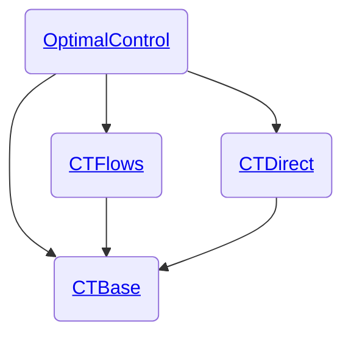

# Welcome to control-toolbox!

The control-toolbox ecosystem gathers &nbsp;
<a href="https://julialang.org">
 
 Julia
</a> &nbsp; packages for mathematical control and applications. 

The root package is [OptimalControl.jl](https://github.com/control-toolbox/OptimalControl.jl) which aims to provide tools to modelise and solve optimal control problems with ordinary differential equations by direct and indirect methods.

> [!TIP]
> From the [documentation](http://control-toolbox.org/OptimalControl.jl), you can find tutorials to define and solve optimal control problems with OptimalControl.jl. 

See also some applications of [OptimalControl.jl](https://github.com/control-toolbox/OptimalControl.jl):

- [Examples from calculus of variations](https://control-toolbox.org/calculus_of_variations)
- [Optimal control in Medical Resonance Imaging](https://control-toolbox.org/medical_resonance_imaging)
- [Orbit transfer from space mechanics](https://control-toolbox.org/kepler)
- ... and more

[](http://control-toolbox.org/OptimalControl.jl)

## Installation [©](https://github.com/JuliaSmoothOptimizers/ADNLPModels.jl?tab=readme-ov-file#installation)

To install [OptimalControl.jl](https://github.com/control-toolbox/OptimalControl.jl) please <a href="https://docs.julialang.org/en/v1/manual/getting-started/">open
Julia's interactive session (known as REPL)</a> and press <kbd>]</kbd> key in the REPL to use the package mode, then add the package:

```julia
julia> ]
pkg> add OptimalControl
```

> [!NOTE]
> Sometimes the above command can fail due to the default Julia registry ('General') not being installed for some reason.
> You can check that the registry is installed with
> 
> ```shell
> pkg> registry st
> Registry Status 
> [23338594] General (https://github.com/JuliaRegistries/General.git)
> ```
> 
> If the General registry is missing, simply add it
> 
> ```shell
> pkg> registry add General
> ```
> 
> then retry the `add` command.

## Main repositories

The control-toolbox [hierarchy](https://github.com/orgs/control-toolbox/repositories?type=all) includes:

* [OptimalControl.jl](https://github.com/control-toolbox/OptimalControl.jl): main package
* [CTBase.jl](https://github.com/control-toolbox/CTBase.jl): fundamentals of the control-toolbox ecosystem
* [CTDirect.jl](https://github.com/control-toolbox/CTDirect.jl): direct transcription of an optimal control problem and resolution
* [CTFlows.jl](https://github.com/control-toolbox/CTFlows.jl): classical flow, Hamiltonian flow, flow from optimal control problem




## Contributing

[issue-url]: https://github.com/issues?q=is%3Aopen+is%3Aissue+user%3Acontrol-toolbox+archived%3Afalse+-repo%3Acontrol-toolbox%2Fbocop+
[first-good-issue-url]: https://github.com/issues?q=is%3Aopen+is%3Aissue+user%3Acontrol-toolbox+archived%3Afalse+-repo%3Acontrol-toolbox%2Fbocop+label%3A"good+first+issue"

Any contributions are welcomed, check out [how to contribute to a Github project](https://docs.github.com/en/get-started/exploring-projects-on-github/contributing-to-a-project). 
If it is your first contribution, you can also check [this first contribution tutorial](https://github.com/firstcontributions/first-contributions).
You can find first good issues at the [first good issues page][first-good-issue-url] and the list of control-toolbox issues at the [control-toolbox list of issues][issue-url].

For any package, if you think you found a bug or if you have a feature request or suggestion, feel free to open an issue.
Before opening a pull request, start an issue or a discussion on the topic, please.
If you want to ask a question, feel free to start a [discussion](https://github.com/orgs/control-toolbox/discussions). 

## Misc

-  calligraphy by [Alain Hurtig](https://www.alain.les-hurtig.org)
- [bocop](https://github.com/control-toolbox/bocop): Bocop3, a direct solver for optimal control problem developed in `C++`
- [control-toolbox wiki](https://github.com/control-toolbox/control-toolbox.github.io/wiki)
